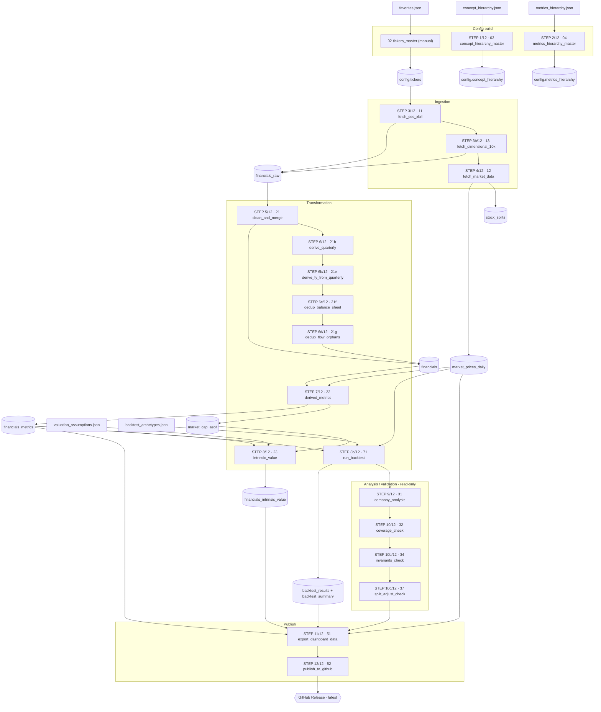

# Fundamentals Analytics — Databricks Pipeline

End-to-end Databricks pipeline that ingests **annual (10-K) and quarterly (10-Q)** XBRL financial filings from SEC EDGAR, fetches market data from Yahoo Finance, and serves Income Statement, Balance Sheet, Cash Flow, and derived financial metrics via direct queries on Delta tables. A public Streamlit dashboard provides read-only access without Databricks credentials.



---

## Project structure

```
fundamentals_databricks_pj/
│
├── 00_config/
│   ├── 01__tickers.py                       ← constants, table names, and XBRL maps (with kind per concept)
│   ├── 02__tickers_master.py                ← builds main.config.tickers (S&P 500 + Russell 3000 + favorites)
│   ├── 03__concept_hierarchy_master.py      ← builds main.config.concept_hierarchy from JSON
│   ├── 04__metrics_hierarchy_master.py      ← builds main.config.metrics_hierarchy from JSON
│   ├── favorites.json                       ← favorite tickers list (with optional overrides: cik, aliases)
│   ├── concept_hierarchy.json               ← accounting concept hierarchy
│   ├── metrics_hierarchy.json               ← derived metrics hierarchy
│   ├── valuation_assumptions.json           ← valuation assumptions (WACC, growth, per-ticker overrides)
│   └── backtest_archetypes.json             ← investor-archetype screens for the backtester (70_backtest)
│
├── _core/                                   ← pure-Python library (no Spark/Streamlit dep), unit-tested
│   ├── valuation.py                         ← scalar reference impls (Graham, DCF, Owner Earnings, EPS CAGR)
│   ├── periods.py                           ← Q4 = FY − YTD_Q3 period arithmetic
│   ├── schemas.py                           ← export↔Streamlit artifact schema contract (single source of truth)
│   ├── splits.py                            ← cumulative stock-split factor for cross-year per-share rescaling
│   └── backtest.py                          ← as-of (no look-ahead), predicate eval, CAGR/drawdown/vol/Sharpe
│
├── 10_ingestion/
│   ├── 11__fetch_sec_xbrl.py         ← SEC EDGAR XBRL API → financials_raw (parallel + Arrow + batched)
│   └── 12__fetch_market_data.py      ← Yahoo Finance (yfinance) → market_data
│
├── 20_transformation/
│   ├── 21__clean_and_merge.py        ← MERGE FY rows into financials
│   ├── 21b__derive_quarterly.py      ← derive standalone Q1..Q4 (with Q4 = FY − YTD_Q3) → MERGE into financials
│   ├── 21c__prune_quarterly.py       ← enforce rolling window of QUARTERLY_WINDOW (=12) quarters per ticker
│   ├── 22__derived_metrics.py        ← FCF, margins, YoY, leverage, valuation ratios (FY only)
│   └── 23__intrinsic_value.py        ← Graham, Graham Revised, DCF, Owner Earnings (FY + TTM)
│
├── 30_analysis/
│   ├── 31__company_analysis.py       ← ad-hoc validation queries
│   ├── 32__coverage_check.py         ← post-pipeline check: favorites coverage + ingestion failures
│   ├── 37__split_adjust_check.py     ← post-pipeline check: stock_splits + split-adjusted cross-year metrics
│   └── 36__run_log_report.py         ← read-only report over the pipeline_runs run-log (last N runs + trend)
│
├── 40_dashboards/
│   ├── 41__dashboard_queries.py      ← SQL feeding the Databricks dashboard
│   └── Main Dashboard.lvdash.json    ← dashboard definition (annual pages + quarterly page)
│
├── 50_publish/
│   ├── 51__export_dashboard_data.py  ← slice financials + metrics + prices + backtest → /tmp/ parquet artifacts
│   └── 52__publish_to_github.py      ← upload to GitHub Release (latest tag)
│
├── 60_streamlit_app/                 ← public Streamlit Cloud dashboard (see its own README)
│
├── 70_backtest/
│   └── 71__run_backtest.py           ← apply archetype screens to history → backtest_results + backtest_summary
│
├── 90_pipelines/
│   ├── 91__full_pipeline.py          ← Job entry point — runs the pipeline in sequence
│   └── 93__delta_maintenance.py      ← OPTIMIZE / VACUUM (gated on run_optimization)
│
└── tests/                            ← pytest suite for the pure _core + Streamlit lib helpers (repo root)
```

> Run the tests locally with `pip install -r requirements-dev.txt && pytest -q`. They cover the
> pure `_core` modules and the Streamlit `lib/` masks/formatters — no Spark or network needed.
> (`requirements.txt` stays minimal; it is the Streamlit Cloud runtime manifest.)

---

## Pipeline flow

```
favorites.json                edit favorite tickers (without touching Databricks)
concept_hierarchy.json        edit accounting concept hierarchy
metrics_hierarchy.json        edit derived metrics hierarchy
valuation_assumptions.json    edit valuation assumptions (WACC, growth, etc.)
      ↓
02__tickers_master              builds main.config.tickers              (manual)
      ↓
03__concept_hierarchy_master    builds main.config.concept_hierarchy    (auto)
      ↓
04__metrics_hierarchy_master    builds main.config.metrics_hierarchy    (auto)
      ↓
11__fetch_sec_xbrl              SEC API → financials_raw                   (10-K + 10-Q)
      ↓
12__fetch_market_data           Yahoo Finance → market_data
      ↓
21__clean_and_merge             FY rows   → MERGE into financials
21b__derive_quarterly           Q1..Q4    → MERGE into financials
21c__prune_quarterly            keep last QUARTERLY_WINDOW Qs per ticker
      ↓
22__derived_metrics             margins, FCF, YoY, leverage, valuation ratios (FY only)
      ↓
23__intrinsic_value             Graham, Graham Revised, DCF, Owner Earnings (FY + TTM)
      ↓
31__company_analysis            validation queries
      ↓
32__coverage_check              verify favorites reached financials + metrics
      ↓
51__export_dashboard_data       slice + write parquet artifacts to /tmp/
      ↓
52__publish_to_github           upload to GitHub Release (latest tag)
```

`main.config.tickers` is rebuilt manually with `02__tickers_master` whenever you edit `favorites.json`. The hierarchies are rebuilt automatically on every run from their JSON files.

---

## Favorites (`favorites.json`)

Favorite tickers are managed by editing `00_config/favorites.json` directly in the Git repository. They are always included in ingestion and in the export to the public dashboard.

```json
[
  {"ticker": "TSM",  "company": "Taiwan Semiconductor", "note": ""},
  {"ticker": "VNOM", "company": "Viper Energy Inc",     "cik": "0001602065", "note": "MLP→C-corp 2024"},
  {"ticker": "FOO",  "company": "Foo Corp",             "aliases": ["FOO-OLD"], "note": "ticker change 2025"}
]
```

| Field | Type | Required | Description |
|---|---|---|---|
| `ticker` | string | yes | Ticker symbol |
| `company` | string | yes | Company name |
| `sector` | string | no | Canonical GICS sector (e.g. `"Information Technology"`). Lowest-precedence fallback — used only when neither S&P 500 nor Russell 3000 supplies a sector for the ticker. Unknown labels are left NULL (the app shows them as "Unknown") |
| `note` | string | no | Free-form note (not used by code) |
| `cik` | string | no | Zero-padded 10-digit CIK (e.g. `"0001602065"`). Forces this CIK in SEC ingestion, bypassing the standard lookup. Useful after MLP→C-corp conversions, spin-offs, or when SEC is slow to update its index |
| `aliases` | list[str] | no | Historical tickers that point to the same company. If the pipeline tries to resolve an alias, it uses the canonical ticker's CIK |

---

## Hierarchies (`concept_hierarchy.json` and `metrics_hierarchy.json`)

Both hierarchies are JSON files in `00_config/` editable from the repo. The pipeline flattens them into Delta tables on every run.

**`concept_hierarchy.json`** — accounting tree (Income Statement, Balance Sheet, Cash Flow): which concepts go under which group and in what order they appear in the dashboard.

**`metrics_hierarchy.json`** — organizes the derived metrics into 2 levels: `category → subcategory → metric`. Eight categories: Profitability, Cash Flow, Growth, Financial Health, Valuation, Capital Returns, Quality & Risk, Intrinsic Value.

To modify them: edit the JSON, commit + push, and the next pipeline run rebuilds the table automatically.

---

## Tables

| Table | Description |
|---|---|
| `{CATALOG}.config.tickers` | Active ticker universe (S&P 500 + Russell 3000 + favorites), with a per-ticker `sector` column (GICS) — precedence Wikipedia GICS (S&P) → normalized IWV → favorites → NULL |
| `{CATALOG}.config.concept_hierarchy` | Accounting concept hierarchy |
| `{CATALOG}.config.metrics_hierarchy` | Derived metrics hierarchy |
| `{CATALOG}.{SCHEMA}.financials_raw` | Append-only audit log of all SEC scrapes (10-K + 10-Q) |
| `{CATALOG}.{SCHEMA}.financials` | Long-format fact table — one row per ticker / fiscal_year / period_type / concept |
| `{CATALOG}.{SCHEMA}.market_data` | Year-end closing prices and market cap per ticker / fiscal_year |
| `{CATALOG}.{SCHEMA}.stock_splits` | Sparse corporate-action store — one row per split (`ticker`, `split_date`, `ratio`); feeds the split-adjusted cross-year per-share computations (EPS-CAGR, Net Buyback Yield %, Piotroski no-dilution). Self-backfilled by `12` on first run |
| `{CATALOG}.{SCHEMA}.financials_metrics` | Derived metrics — margins, FCF, YoY, leverage, valuation ratios |
| `{CATALOG}.{SCHEMA}.financials_intrinsic_value` | Intrinsic value models — Graham, DCF, Owner Earnings (FY + TTM), each computed for the `bull` / `mid` / `bear` scenario (`scenario` column) |
| `{CATALOG}.{SCHEMA}.backtest_results` | Backtest equity-curve series — one row per archetype × fiscal_year (returns + values) |
| `{CATALOG}.{SCHEMA}.backtest_summary` | Per-archetype backtest metrics — CAGR, max drawdown, vol, Sharpe, vs benchmark |
| `{CATALOG}.{SCHEMA}.ingestion_failures` | Append-only log of ingestion errors (SEC + yfinance) per run |
| `{CATALOG}.config.pipeline_runs` | Per-run, per-step telemetry — `run_id`, `step`, `minutes`, `status` (run-log) |
| `{CATALOG}.config.pipeline_run_coverage` | Per-run coverage/freshness snapshot — tickers ingested, favorites %, `max(filed)`, staleness |

---

## `ingestion_failures` — error tracking

Append-only log of tickers that failed during ingestion (SEC or yfinance). Written at the end of `11__fetch_sec_xbrl` and `12__fetch_market_data` on each run.

| Column | Type | Description |
|---|---|---|
| `ticker` | STRING | Ticker that failed |
| `error_type` | STRING | Category: `cik_not_found`, `http_404`, `http_5xx`, `timeout`, `json_decode`, `non_json_response`, `empty_facts`, `other` |
| `error_message` | STRING | First 500 chars of the exception message |
| `step` | STRING | Pipeline step: `fetch_cik`, `fetch_facts`, `extract`, `market_data` |
| `scraped_at` | TIMESTAMP | Timestamp of the run |

Query failures from the latest run:
```sql
SELECT * FROM main.financials.ingestion_failures
WHERE scraped_at = (SELECT MAX(scraped_at) FROM main.financials.ingestion_failures)
ORDER BY error_type, ticker;
```

---

## Coverage check — `32__coverage_check`

Post-pipeline notebook (`30_analysis/32__coverage_check.py`) that verifies all favorite tickers made it through the full pipeline. Checks:

1. Favorites present in `config.tickers` but missing from `financials`
2. Favorites present in `financials` but missing from `financials_metrics`
3. Tickers with ingestion failures in the latest run

**Threshold:** raises `RuntimeError` (hard fail) if >5% of favorites are missing from `financials`. Otherwise warnings only. Runs as step 10/12 in `91__full_pipeline`.

---

## Split-adjust check — `37__split_adjust_check`

Post-pipeline notebook (`30_analysis/37__split_adjust_check.py`) that validates the split-adjust handling for cross-year per-share computations. Per-share concepts (EPS, Shares Diluted) are stored on the **as-originally-filed** split basis per fiscal year, so a stock split (e.g. NVDA 4:1 in 2021, 10:1 in 2024) creates a basis discontinuity that, left uncorrected, reads as a ~−75% / −90% collapse across the split year — corrupting trailing EPS-CAGR (→ Graham Revised), Net Buyback Yield %, and the Piotroski no-dilution signal. `_core/splits.py` rescales **only** those cross-year inputs to a consistent current basis (`factor(period_end) = ∏ ratio for split_date > period_end`); per-row IVs, price comparisons, market cap, and the P/E / Earnings Yield multiples are untouched. Checks:

1. `stock_splits` landed, is non-empty, and has no malformed rows (NULL key / ratio ≤ 0)
2. Known recent splits (NVDA, AAPL, TSLA, AMZN, GOOGL) are present (±3-day window, ratio within 1%) — advisory
3. NVDA Graham Revised + Net Buyback Yield % series, to eyeball against the pre-fix baseline
4. Net Buyback Yield % and Graham Revised MoS% **split-artifact scans** — split tickers should no longer dominate the implausible-magnitude tails
5. **factor = 1 invariant** — each ticker's most-recent fiscal year carries no future split, so current headline valuations are provably unchanged (recomputed in SQL)

**Non-raising by design:** records findings into a module-level `SPLIT_ADJUST_OK` boolean instead of asserting, so `91` can run it **inline via `%run`** (serverless-safe, no child-notebook stall) and treat a red check as non-fatal. Runs as step 10c/12 in `91__full_pipeline`, after the invariants check.

---

## `financials_raw` — append-only audit log

Stores every fact returned by SEC EDGAR's XBRL API, across both annual (10-K) and quarterly (10-Q) filings, plus their amendments. Period metadata is preserved so downstream notebooks can derive standalone quarters and handle restatements deterministically.

| Column | Type | Description |
|---|---|---|
| `ticker` | STRING | Stock ticker symbol |
| `company` | STRING | Company name |
| `stmt` | STRING | `Income Statement` / `Balance Sheet` / `Cash Flow` |
| `concept` | STRING | Display label (from XBRL concept map) |
| `kind` | STRING | `flow_additive` / `flow_nonadditive` / `stock` — drives quarterly derivation logic |
| `fy` | INT | Fiscal year per SEC |
| `fp` | STRING | Fiscal period per SEC: `FY` / `Q1` / `Q2` / `Q3` |
| `form` | STRING | `10-K` / `10-Q` / `10-K/A` / `10-Q/A` |
| `period_start` | DATE | Start of period (NULL for stock concepts) |
| `period_end` | DATE | End of period |
| `period_shape` | STRING | `Q_standalone` (~90d) / `YTD_6M` / `YTD_9M` / `FY_or_TTM` / `snapshot` / `other_Xd` |
| `value` | DOUBLE | Raw value in USD |
| `filed` | DATE | Filing date (used for restatement dedupe — latest `filed` wins) |
| `scraped_at` | TIMESTAMP | Fetch timestamp |

---

## `financials` — clean fact table

Long-format fact table with one row per `ticker / fiscal_year / period_type / concept`. Annual (FY) rows are kept for full history; quarterly rows (Q1..Q4) are limited to the most recent `QUARTERLY_WINDOW` (= 12) per ticker.

| Column | Type | Description |
|---|---|---|
| `ticker` | STRING | Stock ticker symbol |
| `company` | STRING | Company name |
| `stmt` | STRING | `Income Statement` / `Balance Sheet` / `Cash Flow` |
| `concept` | STRING | Financial line item name |
| `fiscal_year` | INT | Fiscal year (from SEC `fy`, not calendar year) |
| `period_type` | STRING | `FY` / `Q1` / `Q2` / `Q3` / `Q4` |
| `period_end` | DATE | End of period — useful for cross-ticker chronological ordering |
| `value` | DOUBLE | Raw value in USD (or native unit for EPS/shares) |
| `is_derived` | BOOLEAN | `true` if computed (Q4 = FY − YTD_Q3, or Q1..Q3 derived from YTD differences); `false` if reported directly |
| `scraped_at` | TIMESTAMP | Source scrape timestamp |

---

## Quarterly data — how it works

The pipeline ingests every fact SEC returns, but the `financials` fact table only exposes **standalone quarter values** (not the YTD accumulated ones). This is achieved in `21b__derive_quarterly` according to the concept's `kind`:

| Kind | Examples | Q1, Q2, Q3 | Q4 |
|---|---|---|---|
| `flow_additive` | Revenue, Net Income, OCF, CapEx | Standalone (~90d) if SEC reported it; otherwise `YTD_n − YTD_(n-1)` | **Always** `FY (10-K) − YTD_Q3` |
| `flow_nonadditive` | EPS, Shares Diluted | Standalone (~90d) only; NULL otherwise | NULL (cannot be derived sensibly) |
| `stock` | Assets, Cash, Equity | Snapshot at `period_end`; deduped by `(ticker, concept, period_end)` keeping latest `filed` | Snapshot at FY end (from `21__clean_and_merge`) |

**Why Q4 is always derived from `FY − YTD_Q3`:** SEC reports the full FY in the 10-K, but never a standalone Q4 fact. Computing Q4 from the 10-K total (rather than summing Q1+Q2+Q3+Q4) ensures any year-end audit adjustments are correctly captured.

**Rolling window of 12 quarters:** `21c__prune_quarterly` enforces a window of the 12 most recent quarters per ticker. FY rows are kept for full history.

**Balance Sheet duplicates:** SEC re-reports the prior FY snapshot in each subsequent 10-Q as a comparative. `21b` dedupes by `(ticker, concept, period_end)` keeping the latest `filed`, so each `period_end` shows exactly one value.

### Verifying quarterly correctness

```sql
-- Should return zero or very few rows (small rounding diffs)
WITH q AS (
    SELECT ticker, concept, fiscal_year,
           SUM(CASE WHEN period_type IN ('Q1','Q2','Q3','Q4') THEN value END) AS qsum,
           MAX(CASE WHEN period_type = 'FY' THEN value END)                    AS fy
    FROM main.financials.financials
    WHERE stmt IN ('Income Statement', 'Cash Flow')
    GROUP BY ticker, concept, fiscal_year
    HAVING COUNT(DISTINCT period_type) = 5
)
SELECT * FROM q
WHERE ABS((qsum - fy) / NULLIF(fy, 0)) > 0.001
ORDER BY ticker, fiscal_year DESC;
```

---

## `market_data` — year-end prices & market cap

Year-end adjusted closing prices fetched from Yahoo Finance via `yfinance`, joined with `Shares Diluted` from `financials` to compute an annual market cap.

| Column | Type | Description |
|---|---|---|
| `ticker` | STRING | Stock ticker symbol |
| `fiscal_year` | INT | Calendar year (yfinance has no notion of fiscal years) |
| `price_close` | DOUBLE | Last adjusted closing price of the year |
| `shares_diluted` | DOUBLE | Diluted share count sourced from `financials` (FY only) |
| `market_cap` | DOUBLE | `price_close × shares_diluted` |
| `fetched_at` | TIMESTAMP | Fetch timestamp |

> **Note on `fiscal_year`:** the column name matches `financials` for join convenience, but the value here is **calendar year**. For companies with non-December fiscal year-ends (AAPL/Sep, MSFT/Jun, WMT/Jan), this introduces a known 0–11 month offset between fundamentals (fiscal) and price (calendar). Acceptable for trend analysis; precise valuation requires `period_end`-based pricing.

---

## Metrics hierarchy — `main.config.metrics_hierarchy`

Lookup table organising derived metrics into categories. Rebuilt every run from `00_config/metrics_hierarchy.json`. Join with `financials_metrics` by `metric` to add `category` / `subcategory` filters to the dashboard and get stable row ordering via `sort_order`.

| Column | Type | Description |
|---|---|---|
| `category` | STRING | Profitability, Cash Flow, Growth, Financial Health, Valuation, Capital Returns, Intrinsic Value |
| `subcategory` | STRING | Margins, YoY, Leverage, Liquidity, Price Multiples, Enterprise Value, Absolute, Payout, Yield |
| `metric` | STRING | Exact name as it appears in `financials_metrics.metric` |
| `unit` | STRING | `percent` / `usd` / `ratio` |
| `requires_market_data` | BOOLEAN | `true` for metrics that depend on `market_data` |
| `sort_order` | INT | Global ordering (10, 20, 30, ...) |

---

## Derived metrics — `financials_metrics`

Long-format table: one row per `ticker / fiscal_year / metric`. Computed by `22__derived_metrics` from `financials` (FY rows only) and `market_data`.

```
ticker | company | fiscal_year | metric          | value
-------|---------|-------------|-----------------|----------
AAPL   | Apple   | 2023        | Net Margin %    |     25.31
AAPL   | Apple   | 2023        | Free Cash Flow  | 99584000000
AAPL   | Apple   | 2023        | P/E             |     28.74
```

The metrics are organized into 8 categories. The full hierarchy lives in
`00_config/metrics_hierarchy.json` and is materialized into `main.config.metrics_hierarchy`.

### Profitability — Margins

| Metric | Formula |
|---|---|
| `Gross Margin %` | `Gross Profit / Revenue × 100` |
| `Operating Margin %` | `Operating Income / Revenue × 100` |
| `Net Margin %` | `Net Income / Revenue × 100` |
| `FCF Margin %` | `Free Cash Flow / Revenue × 100` |

### Profitability — Returns

| Metric | Formula |
|---|---|
| `ROA %` | `Net Income / Total Assets × 100` |
| `ROE %` | `Net Income / Total Stockholders Equity × 100` |
| `ROIC %` | `Operating Income / Invested Capital × 100` |
| `ROCE %` | `Operating Income / Capital Employed × 100` |
| `CROIC %` | `Free Cash Flow / Invested Capital × 100` |

### Profitability — Tangible Returns

Mirror ROCE / ROE with Goodwill + Intangible Assets stripped from the denominator, so the
return is measured against *real* (tangible) capital. A large gap vs. the headline ratio shows
how much reported profitability is leaning on the acquired-intangible base rather than capital
efficiency. See also the *Goodwill Risk* and *Tangible Value* metrics below.

| Metric | Formula | Notes |
|---|---|---|
| `ROTCE %` | `Operating Income / Tangible Capital Employed × 100` | `Tangible Capital Employed = Capital Employed − Goodwill − Intangible Assets`. Tangible analogue of `ROCE %`. |
| `Return on Tangible Equity %` | `Net Income / Tangible Book Value × 100` | NULL unless Tangible Book Value > 0 (a negative tangible base flips the sign and is uninterpretable — the negative TBV is itself the signal). |

### Cash Flow — Absolute

| Metric | Formula |
|---|---|
| `Free Cash Flow` | `Operating Cash Flow − CapEx` |

### Growth — YoY

| Metric | Formula |
|---|---|
| `Revenue YoY %` | YoY % change in Revenue |
| `Net Income YoY %` | YoY % change in Net Income |
| `Operating Cash Flow YoY %` | YoY % change in Operating CF |
| `Free Cash Flow YoY %` | YoY % change in FCF |

### Financial Health — Leverage

| Metric | Formula |
|---|---|
| `Debt / Equity` | `(LT Debt + ST Debt) / Total Stockholders Equity` |
| `Debt / Assets` | `(LT Debt + ST Debt) / Total Assets` |
| `Net Debt / EBITDA` | `(Total Debt − Cash & Equivalents − ST Investments) / (Operating Income + D&A)`; clamped to ±100× |

### Financial Health — Coverage

| Metric | Formula | Notes |
|---|---|---|
| `Interest Coverage` | `Operating Income / abs(Interest Expense)` | EBIT / interest; NULL when interest absent/≈0; clamped to ±1000× |
| `Cash Flow to Debt` | `Operating Cash Flow / Total Debt` | Fraction of total debt coverable by one year of operating cash |

> `Net Debt / EBITDA` can be **negative** for net-cash companies (more cash + ST investments than debt) — healthier than zero leverage, and it renders green.

### Financial Health — Liquidity

| Metric | Formula |
|---|---|
| `Current Ratio` | `Total Current Assets / Total Current Liabilities` |
| `Quick Ratio` | `(Total Current Assets − Inventory) / Total Current Liabilities` — acid-test; missing Inventory treated as 0 |

### Valuation — Price Multiples *(requires `market_data`)*

| Metric | Formula |
|---|---|
| `P/E` | `Market Cap / Net Income` |
| `P/S` | `Market Cap / Revenue` |
| `P/FCF` | `Market Cap / Free Cash Flow` |
| `P/B` | `Market Cap / Total Stockholders Equity` |

### Valuation — Enterprise Value *(requires `market_data`)*

| Metric | Formula | Notes |
|---|---|---|
| `EV` | `Market Cap + Total Debt − (Cash & Equivalents + ST Investments)` | Enterprise value in USD |
| `EV/EBITDA` | `EV / (Operating Income + D&A)` | Outliers beyond ±500× filtered out |

### Valuation — Yields *(requires `market_data`)*

| Metric | Formula |
|---|---|
| `Earnings Yield %` | `Net Income / Market Cap × 100` |
| `Sales Yield %` | `Revenue / Market Cap × 100` |
| `FCF Yield %` | `Free Cash Flow / Market Cap × 100` |
| `Op Cash Flow Yield %` | `Operating Cash Flow / Market Cap × 100` |
| `Book Yield %` | `Total Stockholders Equity / Market Cap × 100` |
| `EBITDA Yield %` | `EBITDA / Market Cap × 100` |

### Valuation — Net-Net *(Graham net current asset value)*

`Total Liabilities` uses the same fallback as Altman Z — `COALESCE(Total Liabilities, Total Assets − Total Stockholders Equity)` — for issuers that don't tag `us-gaap:Liabilities` directly. NCAV is **negative for most firms**; only genuine net-nets are positive (not clamped).

| Metric | Formula | Notes |
|---|---|---|
| `NCAV` | `Total Current Assets − Total Liabilities` | net current asset value, USD |
| `NCAV / Share` | `NCAV / Shares Diluted` | per-share net-net value |
| `NCAV Ratio` | `Market Cap / NCAV` *(only when NCAV > 0)* | price-over-NCAV; lower = cheaper, `< 1` = cap below net current assets, net-net buy ≈ `≤ 0.67`. NULL for negative-NCAV firms. *requires `market_data`* |

### Valuation — Tangible Value

Strips Goodwill + Intangible Assets out of book value — Graham's "real" floor on a liquidation
basis. Goodwill/Intangibles coalesce a missing side to 0 (a common, real case — not every firm
carries both); equity itself is **not** coalesced, so the value is NULL when equity is absent
(same rule as `P/B`).

| Metric | Formula | Notes |
|---|---|---|
| `Tangible Book Value` | `Total Stockholders Equity − Goodwill − Intangible Assets` | USD; can be **negative** (more intangibles than equity) — itself the signal. |
| `Tangible Book Value / Share` | `Tangible Book Value / Shares Diluted` | per-share tangible floor |
| `Price / Tangible Book Value` | `Market Cap / Tangible Book Value` | Graham's preferred substitute for `P/B` when Goodwill is large. **Ungated** (like `P/B`) — a negative ratio flags tangible-basis insolvency. *requires `market_data`* |

### Capital Returns — Payout

SEC reports `Dividends Paid` and `Share Repurchases` as **positive magnitudes** (the repo flips
their sign only at display time), so every formula below takes their absolute value — written
`abs(...)` here — to be sign-agnostic. Denominators are guarded so a loss or negative FCF yields
**NULL** rather than a misleading negative ratio. The two *additive* numerators treat a missing
side as 0, so a dividend-only or buyback-only issuer still gets a Total figure; single-source
ratios stay NULL when their one component is absent.

| Metric | Formula |
|---|---|
| `Dividend Payout Ratio` | `abs(Dividends Paid) / Net Income` — NULL unless Net Income > 0 |
| `Buyback Payout Ratio` | `abs(Share Repurchases) / Net Income` — NULL unless Net Income > 0 |
| `Total Payout Ratio` | `(abs(Dividends Paid) + abs(Share Repurchases)) / Net Income` — NULL unless Net Income > 0 |
| `Payout / FCF` | `(abs(Dividends Paid) + abs(Share Repurchases)) / Free Cash Flow` — NULL unless FCF > 0 |
| `Dividend Coverage (FCF)` | `Free Cash Flow / abs(Dividends Paid)` — NULL unless dividends ≠ 0 |

### Capital Returns — Yield

| Metric | Formula | Notes |
|---|---|---|
| `Dividend Yield %` | `abs(Dividends Paid) / Market Cap × 100` | *requires `market_data`* |
| `Buyback Yield %` | `abs(Share Repurchases) / Market Cap × 100` | gross cash spent on buybacks; *requires `market_data`* |
| `Shareholder Yield %` | `(abs(Dividends Paid) + abs(Share Repurchases)) / Market Cap × 100` | *requires `market_data`* |
| `Net Buyback Yield %` | `−(YoY % change in Shares Diluted)` | **share-count based, dilution-aware** — nets SBC/issuance against buybacks (a shrinking share count → positive yield), unlike the gross cash-based `Buyback Yield %`. No market data needed. The YoY share count is **split-adjusted** (`_core/splits.py`) so a split isn't misread as ±900% dilution. |

### Quality & Risk

| Metric | Formula | Notes |
|---|---|---|
| `Altman Z-Score` | `1.2·X1 + 1.4·X2 + 3.3·X3 + 0.6·X4 + 1.0·X5` where X1 = Working Capital / Total Assets, X2 = Retained Earnings / Total Assets, X3 = Operating Income (EBIT) / Total Assets, X4 = Market Cap / Total Liabilities, X5 = Revenue / Total Assets | Bankruptcy risk. > 3 safe, 1.8–3 grey, < 1.8 distress. *Requires `market_data`* (X4). **Original manufacturing model** — less meaningful for financial firms / non-manufacturers (same caveat class as EV/EBITDA for banks). NULL unless Total Assets and Total Liabilities are both present and > 0. `Total Liabilities` falls back to `Total Assets − Total Stockholders Equity` (BS identity) for issuers that don't tag us-gaap:Liabilities directly (e.g. VZ). |
| `Piotroski F-Score` | Sum of 9 binary signals (0–9 integer) | Fundamental health. Profitability: ROA > 0, Operating CF > 0, ΔROA > 0, Operating CF > Net Income. Leverage/liquidity/dilution: Δ(Debt/Assets) < 0, ΔCurrent Ratio > 0, no share dilution (≤ +0.1%). Efficiency: ΔGross Margin > 0, ΔAsset Turnover > 0. NULL in a ticker's first year (no prior to compare). ≥ 7 strong, ≤ 3 weak. |
| `Accruals Ratio` | `(Net Income − Operating Cash Flow) / Total Assets` | Earnings quality. High positive accruals = earnings not backed by cash → **lower is better** (≤ 0.05 good, ≥ 0.15 poor). A company with operating cash flow above net income shows a negative (good) accrual. |

### Quality & Risk — Goodwill Risk

How exposed the company is to acquisition-residue write-down risk. Goodwill coalesces to 0 in
the numerator — the `us-gaap:Goodwill` tag is standard/reliable enough that "absent" reads as a
true zero (unlike the multi-tag debt case, where absence was ambiguous).

| Metric | Formula | Notes |
|---|---|---|
| `Goodwill / Total Assets %` | `Goodwill / Total Assets × 100` | what fraction of the balance sheet is unverifiable acquisition residue |
| `Goodwill / Tangible Equity %` | `Goodwill / Tangible Book Value × 100` | how much of *real* equity a full Goodwill write-off would wipe out. `> 100%` = Goodwill exceeds the entire tangible equity base. NULL unless Tangible Book Value > 0. |
| `Goodwill / Market Cap %` | `Goodwill / Market Cap × 100` | how much of today's price is accounting residue. *requires `market_data`* |

### Intrinsic Value *(requires `market_data`)*

Computed by `23__intrinsic_value` for **each fiscal year** and for **TTM** (rolling 4 quarters), under four lenses. Each is emitted both into `financials_intrinsic_value` (one row per `ticker / period_type / fiscal_year / method`, with an `assumptions` JSON column) and exposed as `(FY)` / `(TTM)` metrics here.

| Method | Idea | Formula |
|---|---|---|
| `Graham Number (FY/TTM)` | Graham's napkin floor for defensive stocks | `sqrt(22.5 × EPS × Book Value per Share)` |
| `Graham Revised Value (FY/TTM)` | Graham's growth formula, normalized to the AAA yield | `(EPS × (8.5 + 2g) × 4.4) / Y` |
| `DCF Value per Share (FY/TTM)` | 2-stage DCF — explicit growth horizon + Gordon terminal | Discounted 10-year FCF (or Owner Earnings) projection + terminal value, net of debt, plus cash, ÷ diluted shares |
| `Owner Earnings (FY/TTM)` | Buffett's cash earnings (absolute $, ungated) | `Net Income + D&A + SBC − CapEx − ΔWC` |
| `Owner Earnings Value/Share (FY/TTM)` | Capitalized Owner Earnings | `OE × multiple` (default 15×) **or** `OE / discount_rate` (Gordon perpetuity) ÷ shares |
| `MoS %` | Margin of Safety vs. market price | `(Intrinsic Value − Price) / Intrinsic Value × 100` |

**Applicability guards (a method returns NaN and emits no row when it doesn't apply):**

- **`Graham Number`** is suppressed for distorted book value — negative Retained Earnings or `P/B > 10` — and requires positive EPS and BVPS.
- **`Graham Revised`** requires positive EPS; growth `g` is the company's own **trailing 5-year EPS CAGR** (point-in-time), floored at 0 (Graham's 8.5 base *is* the no-growth P/E — a shrinking firm shouldn't push the multiple below it) and capped at `growth_cap`, falling back to the `dcf.growth_stage1` assumption when the CAGR is undefined. The EPS series feeding this CAGR is **split-adjusted** (`_core/splits.py`) so a stock split isn't misread as an earnings collapse — see the *Split-adjust check* section.
- **`DCF` / `Owner Earnings`** require positive shares and positive starting cash flow, and `WACC > terminal growth`.

**Sector-aware flow-model skip.** The flow-based models — **DCF** and **Owner Earnings Value/Share** — are skipped by default for **Energy, Financials, and Real Estate** (`sector_policy.flow_model_skip_sectors` in `valuation_assumptions.json`, keyed off `config.tickers.sector`). The rationale: depleting commodity assets (a 2-stage perpetual-growth DCF doesn't apply, and depletion baked into OCF inflates FCF), financial-intermediation balance sheets, and REIT book depreciation that distorts Net Income — these belong on FFO, not DCF/OE. Precedence per ticker × method:

1. An explicit per-ticker `dcf.skip` / `owner_earnings.skip` (`true` **or** `false`) in `overrides` **always wins** — it can re-enable a method for a single name or force-skip it.
2. Else the sector default applies (skip if the ticker's GICS sector is flagged).
3. Else no skip. Sector NULL / unknown ⇒ no skip.

The Graham methods are **never** sector-gated, and the absolute `Owner Earnings` ($) metric is always emitted regardless of the valuation skip.

**Bull / Mid / Bear scenarios.** Every method is computed under three assumption profiles —
`bull`, `mid`, `bear` — declared in `valuation_assumptions.json → scenarios`. `mid` is the base
case and is **byte-for-byte the former single `defaults` profile**, so legacy numbers are
unchanged; `bull`/`bear` widen and tighten the levers (Graham `magic_number`, Graham-Revised
`base_pe` / `graham_aaa_yield` / `growth_cap`, DCF `wacc` / `growth_stage1` / `growth_terminal`,
Owner-Earnings `multiple` / `discount_rate`). Each `(ticker, period_type, fiscal_year, method,
scenario)` is one row in `financials_intrinsic_value` (MERGE-keyed on that grain, including the
`scenario` column). In the metrics hierarchy the `mid` case is the unsuffixed metric (e.g.
`DCF Value per Share (FY)`) and the other two are emitted as `… — Bull` / `… — Bear` siblings.
Per-ticker `overrides` are **scenario-aware**: a lever that varies by scenario must be given as a
`{bull, mid, bear}` object so the override doesn't collapse that name's spread; structural flags
(`skip`, `horizon_years`) stay flat scalars.

> Valuation metrics are only populated for `ticker / fiscal_year` combinations where `market_data` has a valid `market_cap`. Assumptions (WACC, growth, multiples, per-ticker and per-sector skips, per-scenario profiles) are configured in `00_config/valuation_assumptions.json` — editing it requires no code change.

---

## Backtester — `70_backtest/71__run_backtest`

Applies named **investor-archetype** screens to historical fundamentals and reports forward
returns, **with no look-ahead bias**. Archetypes are declared in
`00_config/backtest_archetypes.json` — each is a list of `[metric, op, threshold]` predicates
(matching `financials_metrics` labels) plus a holdings cap and a ranking rule. Ships with
`graham_defensive` (cheap + liquid + profitable), `lynch_garp` (GARP — PEG is not a stored
metric, so it's approximated via a modest P/E + earnings growth), and `quality_compounder`
(high returns on capital, modest leverage).

- **No look-ahead.** A fiscal year's metrics are usable only from their **as-of date** — the
  10-K `filed` date (from `financials_raw`), or `period_end + as_of_lag_days` (default 90) when
  the filing date is missing. Each name enters at the close on its as-of date and exits at the
  next year's as-of date; annual cohorts are equal-weighted and chained into an equity curve.
- **Benchmark** is SPY over each holding's own window — **NULL** if `SPY` is absent from
  `market_prices_daily` (add it to the price universe to enable benchmark-relative metrics).
- **⚠️ Survivorship bias.** The universe is tickers alive *today*; delisted names never enter,
  so returns are biased **upward**. Treat results as a relative comparison between archetypes,
  not an absolute forecast. The caveat is surfaced in the notebook, the JSON, and the app banner.

Writes `backtest_results` (series) + `backtest_summary` (metrics), then `51` exports
`dashboard_backtest.parquet` for the public app. The scalar return stats live in
`_core/backtest.py` and are reused by both the notebook and the Streamlit view, so the numbers
reconcile by construction.

---

## Run-log / observability — `main.config.pipeline_runs`

`91__full_pipeline` persists per-run telemetry so freshness and coverage are queryable over
time, not just printed once. At the end of each run it writes:

- **`pipeline_runs`** — one row per step (`run_id`, `run_started_at`, `step`, `minutes`,
  `status` ∈ `ok`/`failed`/`skipped`, `rows_written`), MERGE-keyed on `(run_id, step)`.
- **`pipeline_run_coverage`** — one snapshot per run: total tickers ingested, favorites-reached-
  metrics %, `max(filed)` and staleness in days (reuses the `32__coverage_check` logic).

`run_id` = the run's start stamped `YYYYMMDDThhmmssZ`, tying both tables together. Telemetry is
wrapped in try/except — a logging failure never aborts an otherwise-successful run. Read it with
`30_analysis/36__run_log_report` (last N runs, latest-run step breakdown, coverage/freshness trend).

---

## Delta maintenance — `90_pipelines/93__delta_maintenance`

Idempotent `OPTIMIZE` (file compaction) + `VACUUM` (`RETAIN 168 HOURS`, never lowering the
retention safety check) over `financials_raw`, `financials`, `financials_metrics`,
`financials_intrinsic_value`, `market_prices_daily`, and legacy `market_data`. Wired into `91`
as the final step, **gated on `run_optimization`** (a default run is a no-op). `ZORDER` is a
clearly-commented opt-in (off by default — `market_prices_daily` is liquid-clustered and can't be
Z-ordered; `ticker` is already the partition key elsewhere). `financials_raw` row-level retention
is an opt-in block, **disabled** by design (the table is append-only).

---

## Public Streamlit Dashboard

**Live app: https://alm-equity-fundamentals.streamlit.app/**

A read-only dashboard at Streamlit Community Cloud renders the same data without Databricks credentials. Currently serves ~2,500 tickers (S&P 500 + Russell 2000 proxy) with synthetic data for preview; production data is published via GitHub Release. See [`60_streamlit_app/README.md`](fundamentals_pipeline/60_streamlit_app/README.md) for details.

The landing-page **screener** filters the universe by index membership (All / S&P 500 / Russell 3000 / Favorites) and by **GICS sector** — the 11 canonical sectors sourced from `config.tickers.sector`, with a no-op `All sectors` default. Tickers with no sector (NULL/legacy artifacts) fall into an **Unknown** bucket. Each company's sector is also shown as a chip on the detail-page masthead.

### Valuation tape (screener hero)

The screener's hero is a **P/E band ribbon** (the "valuation tape") that bins the
sector-filtered universe into Graham-style P/E bands — **Loss** (`< 0`), **Cheap** (`0–10x`),
**Fair** (`10–15x`), **Full** (`15–25x`), **Rich** (`> 25x`). It replaces the legacy 4-card stat
band (which is kept only as a fallback when P/E is absent from the published artifacts). Each
band is a **one-click P/E filter**: clicking it round-trips the band's range into the P/E pill by
toggling the full filter state in the URL (state-in-URL, so it survives reloads and is
shareable). NaN-P/E rows are excluded from every band. A slim mono **medians** line sits under
the tape as supporting metadata. Pure frontend — no pipeline or schema change.

> **Invariant:** the band edges in `_valuation_tape` (`views/screener.py`) must stay equal to
> `_VALUATION_MULTIPLE_BAND` in `lib/screener.py`, or a band click won't round-trip into the
> P/E pill correctly.

### Valuation football field

The company detail page (Derived metrics tab) renders a horizontal "football field" below the metrics grid: one bar per intrinsic-value method spanning its estimate range, with a base-case dot and a single vertical line for the current market price (`render_valuation_football_field` in `lib/render.py`, inline SVG).

- **The bars are a presentational ±15% sensitivity band** (`FF_BAND`) around each method's stored point estimate — **not** a confidence interval. There is no stored low/high triple; the envelope is constructed for readability (a caption says so). The market price is backed out of any method's `MoS %` row (`price = IV × (1 − MoS/100)`), since the app stores no per-share price directly.
- **`Graham Number` is intentionally excluded** — it's suppressed upstream for distorted-book firms and is often a wild outlier that would crush the shared x-scale. Only Graham Revised, DCF, and Owner Earnings are shown (`FF_METHODS`). For Energy / Financials / Real Estate names the DCF and Owner Earnings bars are absent (sector-skipped upstream), so the field shows Graham Revised alone — by design.
- **Over/under-valued color rule:** a method's base **above** the price line → undervalued → green (`--positive`); **below** → overvalued → red (`--negative`); neutral blue when no price is available. So "every bar below the line" reads instantly as overvalued (e.g. AAPL), "every bar above" as undervalued (e.g. VZ).
- **Graceful degradation:** no methods → the card is hidden (returns `""`); a single method still renders (with a note); no `market_data` price → bars render neutral with no price line and a "no market price" caption; non-finite or ≤0 base values are skipped.

---

## Dashboard — `Main Dashboard.lvdash.json`

The dashboard has the following pages:

- **Scorecard** — high-level KPIs (annual)
- **Balance Sheet** — annual BS pivot
- **Income Statement** — annual IS pivot
- **Cash Flow** — annual CF pivot
- **Derived Metrics** — all calculated metrics (annual)
- **Quarterly** — last 12 quarters per ticker:
  - Quarterly Revenue with YoY growth (same-Q comparison)
  - Quarterly Income Statement pivot
  - Quarterly Balance Sheet snapshot with YoY change

All annual pages filter `period_type = 'FY'` in their queries. The quarterly page filters `period_type IN ('Q1','Q2','Q3','Q4')`.

---

## Pipeline parameters

The full pipeline (`91__full_pipeline`) accepts Databricks Job parameters at runtime:

| Parameter | Default | Description |
|---|---|---|
| `tickers_override` | *(empty)* | Comma-separated list of tickers — bypasses `main.config.tickers` (ingestion only; the export still publishes the full table) |
| `run_optimization` | `false` | Run `93__delta_maintenance` (`OPTIMIZE + VACUUM`) at the end of the pipeline |
| `rebuild_config` | `false` | Reserved — ticker rebuild must still be run manually via `02__tickers_master` |
| `force_full_refresh` | `false` | Re-ingest ALL tickers, ignoring the 3-day freshness guard in `11__fetch_sec_xbrl` (use for a backfill after an ingest/merge logic change) |

Example:
```json
{"tickers_override": "AAPL,TSLA,MSFT", "run_optimization": "false"}
```

---

## Pipeline observability

`91__full_pipeline` times every step as it runs and persists the result so freshness, coverage,
and per-step cost are queryable over time — not just printed once into the Job log.

### Per-step wall-clock timing

A small helper defined right after the `%pip` cell (it must survive the interpreter restart `%pip`
forces) captures the cost of each step:

```python
def _record_step(name, t0, status="ok"):
    mins = (time.monotonic() - t0) / 60.0
    STEP_TIMINGS.append({"step": name, "minutes": mins, "status": status})
    print(f"  ⏱ {name}: {mins:.1f} min ({status})")
```

Each step stamps `_t0 = time.monotonic()` before its `%run`, then calls `_record_step(...)` after
it returns. The deltas accumulate in the in-session `STEP_TIMINGS` list (relying on shared-session
state across `%run` cells — the same Databricks-only assumption `pipeline_start` already depends on).
Section **13b** prints the breakdown slowest-first with each step's share of the total, then the
`Σ steps` total against the `Wall-clock (start→now)` — the small gap between them is the untimed
`%pip` + banner cells.

### Persistence targets

Section **13b** also writes the timings to an append-only history table, and section **13c** writes
the current run-log + a coverage snapshot. Both writes are wrapped so a telemetry failure never
aborts an otherwise-successful run.

| Table | Status | Columns |
|---|---|---|
| `{CATALOG}.{SCHEMA}.pipeline_run_timings` | **legacy** (back-compat) | `run_ts`, `step`, `minutes`, `n_tickers` — append-only, keyed implicitly by `run_ts = pipeline_start` |
| `{CATALOG}.config.pipeline_runs` | **current** | `run_id`, `run_started_at`, `step`, `minutes`, `status` (`ok`/`failed`/`skipped`), `rows_written` — MERGE-keyed on `(run_id, step)`, so re-running the cell in-session is idempotent |
| `{CATALOG}.config.pipeline_run_coverage` | **current** | one snapshot per run: `total_tickers_ingested`, `total_favorites`, `favorites_in_metrics`, `favorites_pct`, `max_filed`, `staleness_days` |

`run_id` is `pipeline_start` stamped `YYYYMMDDThhmmssZ`, tying the per-step rows to their coverage
snapshot. `pipeline_runs` supersedes `pipeline_run_timings` (it adds `run_id` + `status`); the legacy
table is still written for back-compat but new readers should use `pipeline_runs`.

### Querying run history

`30_analysis/36__run_log_report` is a read-only report (pure `SELECT`s + `display()`, Databricks-only)
over `pipeline_runs` + `pipeline_run_coverage`. It shows the last `N_RUNS` (= 20) runs with total
duration / step count / failures, the latest run's per-step breakdown (slowest first), and the
coverage/freshness trend over time.

### A failed step is absent from the log

`_record_step` runs **only after** its `%run` returns. A fatal step (e.g. ingestion or the inline
export/publish) aborts the run before reaching its `_record_step`, so it never gets an `ok` row —
its absence from `STEP_TIMINGS` (and from both tables) *is* the failure signal. The non-fatal checks
(Coverage, Invariants, Split-Adjust) are caught and pass their own `status="failed"`, so they appear
with a red status rather than vanishing.

---

## Column reference

All monetary values are displayed in **millions or billions USD** in the dashboard widgets (raw values in tables are in USD). Per-share figures (EPS) and share counts are kept in their native units.

### Income Statement

| Concept | Display label | Unit |
|---|---|---|
| `Revenue` / `Revenue (contract)` | Revenue | $ |
| `Cost of Revenue` | Cost of Revenue | $ |
| `Gross Profit` | Gross Profit | $ |
| `R&D Expense` | R&D | $ |
| `SG&A Expense` | SG&A | $ |
| `Operating Expenses` | Operating Expenses | $ |
| `Operating Income` | Operating Income | $ |
| `Interest Expense` | Interest Expense | $ |
| `Income Before Tax` | Income Before Tax | $ |
| `Income Tax` | Income Tax | $ |
| `Net Income` | Net Income | $ |
| `EPS Basic` | EPS Basic | USD |
| `EPS Diluted` | EPS Diluted | USD |
| `Shares Diluted` | Shares Diluted | shares |

> Revenue is coalesced from two XBRL tags (`Revenues` and `RevenueFromContractWithCustomerExcludingAssessedTax`) since companies report under different tags.

---

## Architectural notes

**Favorites in JSON, not Delta.** An earlier iteration used a Delta table (`main.config.favorites`) managed via a notebook. Simplified to `favorites.json` so the favorites list can be edited from the editor or GitHub without opening Databricks.

**Hierarchies in JSON, not code.** Both `concept_hierarchy.json` and `metrics_hierarchy.json` live as declarative JSON in `00_config/`. Each has a master notebook that flattens it into a Delta lookup table. This decouples structure (order, grouping, categories) from transformation logic.

**Why `fiscal_year` everywhere.** Migrated from `year` to `fiscal_year` to be semantically correct: SEC reports against fiscal years (which differ from calendar years for ~30% of US issuers). The column name is consistent across `financials`, `financials_metrics`, and `market_data` for join convenience, even though `market_data` stores calendar-year-end prices.

**SEC fetch parallelism.** `11__fetch_sec_xbrl` uses `ThreadPoolExecutor` with 8 workers and a global rate limiter (`MIN_REQUEST_GAP = 0.12s` enforced via Lock + monotonic clock). Writes happen incrementally in batches of 250 tickers via `flush_batch()` — avoids building a multi-million-row pandas DataFrame in driver memory before a single `createDataFrame` call.

**Performance: `localCheckpoint(eager=True)`, not `cache()`.** This is a serverless-only workspace, where `.cache()` / `.persist()` / `.unpersist()` raise `[NOT_SUPPORTED_WITH_SERVERLESS]`. To stop expensive Spark frames from being recomputed every time they're consumed (`count()` + a MERGE + a downstream join all re-trigger the full lineage), the transformation notebooks materialize reused frames once with `localCheckpoint(eager=True)`, which also truncates the lineage. It's applied where a frame is consumed 2× or more on top of a costly upstream (a full scan of the ~81M-row `financials_raw` slice, a wide pivot, or a multi-window dedup): `raw` and `clean_fy` in `21__clean_and_merge`, `flow_dedup` / `flow_quarterly` / `stock_quarterly` in `21b__derive_quarterly`, `wide` / `long_base` / `long_val` in `22__derived_metrics`, and `fin_subset` / `quarters_ranked` in `23__intrinsic_value`. Checkpoints live on the cluster's local disk and are released when the session closes.

**Performance: vectorized record-building, no `iterrows`.** Hot per-row loops in the Python-side stages were replaced with vectorized NumPy/pandas: `11__fetch_sec_xbrl` builds per-ticker rows column-wise (the old `df.apply(..., axis=1)` was GIL-bound and dominated stage-11 CPU), and `23__intrinsic_value` computes all four valuation methods over the whole frame at once instead of `pdf.iterrows()` × 4 methods.
